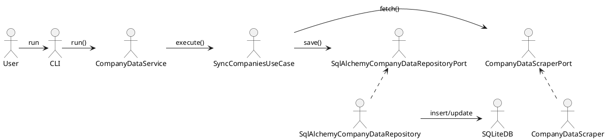

# Architecture

FLY follows the principles of Hexagonal Architecture. The code is organised in four layers:

```
Presentation ↔ Application ↔ Domain ↔ Infrastructure
```

- **Presentation** – The CLI controller in `presentation/cli.py` starts the application.
- **Application** – Services and use cases orchestrate domain logic. Examples are `CompanyDataService` and `SyncCompaniesUseCase`.
- **Domain** – Pure dataclasses and ports defining contracts (`domain/dto`, `domain/ports`).
- **Infrastructure** – Concrete adapters such as scrapers and repositories.

Dependencies flow inward only: presentation depends on application, which depends on domain. Infrastructure implements ports from the domain but does not import from application.

## Key Concepts

- **Controller** – Triggers execution (CLI).
- **Service** – Coordinates use cases and domain objects.
- **UseCase** – Encapsulates a single business scenario, e.g. `SyncCompaniesUseCase`.
- **DTO** – Immutable data container passed across layers. All DTOs live in `domain/dto` and use `@dataclass(frozen=True)`.
- **Port** – Interface defined in `domain/ports` (e.g., `SqlAlchemyCompanyDataRepositoryPort`).
- **Repository** – Infrastructure implementation of a port using SQLAlchemy.
- **Entity** – ORM model mapping a table; converts to/from DTO (see `CompanyDataModel`).

Adapters and helper utilities are injected through constructors so that each component remains testable. `BaseProcessor` is used by the scrapers to compose small processing steps.

Each feature is expressed as a use case class. Services build the use case, inject repositories or scrapers, and expose a `run()` method.


## Conceptual Overview – The FLY Metaphor

Imagine an old-fashioned company called FLY (Financial Yearly Ledger). It has no technology or code, but you’ve hired it to provide accurate and up-to-date financial data about companies listed on a stock exchange. In this analogy, you are the user and FLY is the codebase—a structured organization that operates with logic and precision.

We will walk through each layer of the software architecture by imagining what role it plays inside the company FLY.

### 1. Domain – The Business Owner and the Rules
This is the heart of the system. The domain knows: 
- What matters. 
- What should be done. 
- How data is structured. 
- What the expected operations are.

It does not perform any action directly. Instead, it defines contracts (called Ports) and uses pure data containers (DTOs) to describe business-relevant information.

Think of the domain as the owner of the company. He knows what needs to be done to deliver value to the customer. He writes internal policies and business rules but never touches the actual paperwork himself.

#### 1.1. DTOs (Data Transfer Objects)
DTOs are like the company's notebooks—clean, structured, immutable pages where data is carefully written down and passed around.

The FLY owner maintains several DTO notebooks:
- One for company registration data (e.g., name, CNPJ, ticker).
- One for report tracking (document serials, NSD).
- Another for financial statements (e.g., net income, assets).

They do not contain behavior—only structured data, typed and validated.

#### 1.2. Entities (Planned)
Entities are not yet implemented, but they will represent domain concepts with identity and behavior. They will hold logic and consistency checks, unlike DTOs which are just carriers.

#### 1.3. Ports (Interfaces)
Ports are abstract protocols for interacting with the outside world. Two types are central:

- SourcePort: defines how data is acquired. The Source is like the prospection or research department, specialized in gathering new data.
- RepositoryPort: defines how data is saved or queried. The Repository is like the company’s archive department—structured, permanent, regulated.

Each department has a manual (interface) that strictly defines how work must be done, ensuring loose coupling. The archive team doesn’t know how the prospector does his job. A prospector can be replaced (e.g., switch from HTTP to Selenium) without affecting the rest of the company—as long as the rules in the manual (the interface) are respected.

##### Port Convention: Generic Base → Specific Port → Concrete Adapter
To ensure consistency, all external adapters (repositories, scrapers, queues, etc.) follow this layered pattern:

BasePort[T] (generic, domain)
        ↓
SpecificPort (typed, domain)
        ↓
ConcreteAdapter (implementation, infrastructure)

Example: 
Layer: Base Port | Element SqlAlchemyRepositoryBasePort(T) | File domain/ports/base_repository_port.py
Layer: Specific Port | Element SqlAlchemyCompanyDataRepositoryPort | File domain/ports/company_repository_port.py
Layer: Implementation | Element SqlAlchemyCompanyDataRepository | File infrastructure/repositories/company_repository.py

### 2. Application – The Managers and Project Coordinators
This layer bridges the domain and the real execution. It doesn't know about technology (no SQL or HTTP) and doesn't contain business rules (no validations), but it coordinates everything.

This is the management floor of FLY. Managers get tasks from the owner and delegate the work to specialists and departments.

#### 2.1. Services and UseCases
Service: The department head. Exposes a run() method and takes the user’s request.

UseCase: A domain-specific specialist. Executes one business operation (e.g., synchronize companies).

The FLY owner never talks to a worker directly. He calls the Head of the CompanyData Data Department (the CompanyDataService).

The Head turns to the CompanyData Synchronization Specialist (SyncCompaniesUseCase) and gives him tools and instructions:

- Ask the archive (Repository) for the existing company codes.
- Ask the scout (Source) to fetch new company data from the exchange.
- Compare new and existing records.
- Ask the archive to save only what’s missing.
- No domain logic is defined here—it’s all orchestration.

### 3. Infrastructure – The Factory Floor
The infrastructure is where the actual work happens. It translates abstract protocols (ports) into real-world implementations using:

- APIs
- Files
- Databases
- Network drivers

This is the operational floor of FLY: developers, clerks, file cabinets, scrapers, spreadsheets, and scrubbing tools.

It includes:

- Adapters: e.g., CompanyDataScraper implements SourcePort.
- Repositories: e.g., SqlAlchemyCompanyDataRepository implements RepositoryPort.
- ORM Models: Define the data schema using SQLAlchemy.
- Scrapers: Fetch HTML, XML, or JSON from the exchange.
- Parsers & Cleaners: Normalize raw data.
- Helpers: Utilities like threading, time handling, or logging context.
- Logging: Captures process info for monitoring and debugging.
- Config: Loads settings from files or environment.

Infrastructure changes often—but the domain remains stable because of abstraction.

### 4. Presentation – The Front Desk
This is the user-facing entry point of the system. In the current version of FLY, it’s a CLI interface, but it could be a REST API, gRPC, or GUI in the future.

At FLY, the front desk receptionist receives your request and routes it internally. The receptionist does not handle documents—only initiates the process and gives you back the result when it’s done.

This layer:

- Builds the full object graph (wiring dependencies).
- Calls the correct service.
- Shows the output or error.

No logic. No data validation. Just orchestration and delegation.

## Architectural Model

The table below maps the main components to their respective layers.

| Component | Layer | Type |
|-----------|-------|------|
| `cli.py` | Presentation | Controller |
| `CompanyDataService` | Application | Service |
| `SyncCompaniesUseCase` | Application | Use case |
| `CompanyDataDTO` | Domain | DTO |
| `SqlAlchemyCompanyDataRepositoryPort` | Domain | Port |
| `SqlAlchemyCompanyDataRepository` | Infrastructure | Repository |
| `CompanyDataScraper` | Infrastructure | Adapter |

### Ports and Adapters

Every external dependency is accessed through a port defined in the domain. The
infrastructure layer implements these ports. For example:

- `SqlAlchemyCompanyDataRepositoryPort` ← `SqlAlchemyCompanyDataRepository`
- `CompanyDataScraperPort` ← `CompanyDataScraper`

### Dependency Map

Dependencies always point inward:

1. **Presentation → Application** – the CLI triggers services.
2. **Application → Domain** – services call use cases and ports.
3. **Infrastructure → Domain** – adapters implement ports.

### High-level Flow



This diagram shows one example of how a request flows through the system. The
ports allow the application to remain unaware of the specific adapters used.

