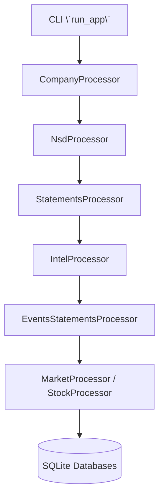

# Finance Ledger Yearly (FLY)

### What is This?
Finance Ledger Yearly (**FLY**) is a comprehensive **financial data app** designed to automate the extraction and processing of financial data from various online sources. The app retrieves detailed company information, financial documents, and **standardized financial statements**, storing this data in a local database for easy access and analysis.

## How It Works, Behind the Wheels
1. **Company Information Scraping**  
   - Finds company names, tickers, sectors, and registration data.
   - Saves the latest updates to avoid redundant data.

2. **Financial Reports Processing**  
   - Extracts and standardizes company financial statements.
   - Ensures that data follows a structured, readable format.
   - Only updates reports if new information is available.

3. **NSD (Document Number) Tracking**  
   - Keeps track of financial disclosure documents.
   - Fills in missing document sequences intelligently.

4. **Stock Market & Corporate Events Analysis**  
   - Fetches stock prices, stock splits, and dividend information.
   - Matches stock performance with financial statements.

5. **Performance & Optimization**
   - Uses a multi-threaded system to process data efficiently.
   - Tracks memory and execution time to keep things running smoothly.

### Processing Flow



## How to Install

### **Requirements**
To run FLY, you need:
- **Python 3.7 or newer** installed on your system.
- **Google Chrome** (used for web scraping).
- Required Python libraries (install them using the command below).

### **Installation Steps**
1. **Download the software**  
If you haven't already, get the project files by running:
```sh
git clone https://github.com/faustostangler/FLY.git
cd FLY
```

2. **Install required libraries**  
Install the necessary Python packages by running:
```sh
pip install -r requirements.txt
```

## How to Use
### **Run the Full System**
To run everything at once and process all available data:
```sh
python b3.py
```

## Contributing

1. **Fork the repository**
2. **Create a new branch:**
   ```sh
   git checkout -b feature-branch
   ```
3. **Commit your changes:**
   ```sh
   git commit -am 'Add new feature'
   ```
4. **Push to the branch:**
   ```sh
   git push origin feature-branch
   ```
5. **Create a new Pull Request**

## License
This project is licensed under the MIT License - see the LICENSE file for details.

## Acknowledgements
- **Selenium** for web automation
- **BeautifulSoup** for parsing HTML
- **SQLite** for the database

---

"Inspired by the Pampas and crafted with yerba mate in South America: an authentic gaucho product."
